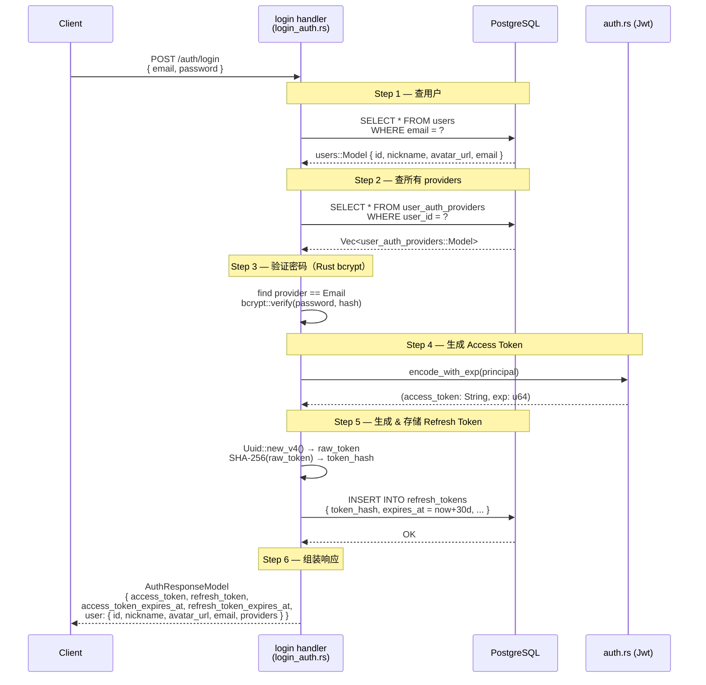
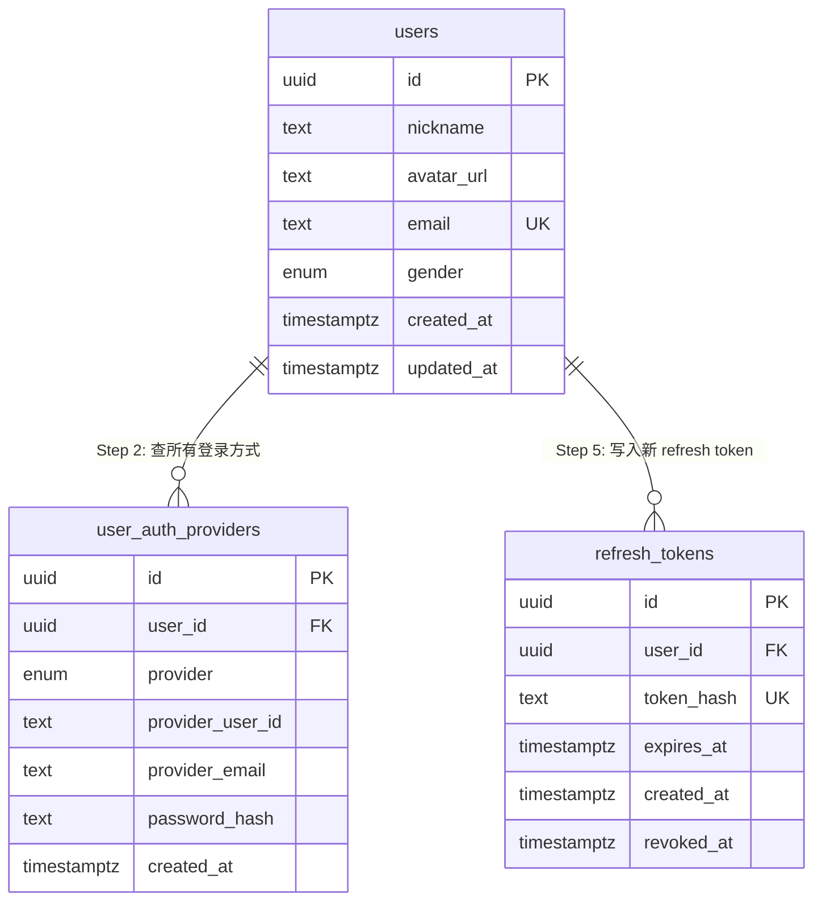
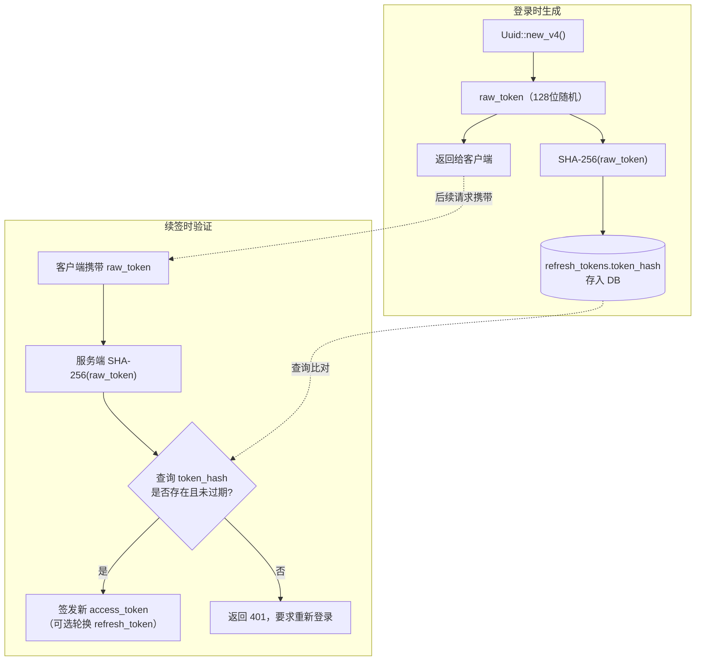

# Login 返回字段扩展方案

目标：将 `POST /auth/login` 的成功响应从 `{ access_token }` 扩展为完整的 `AuthResponseModel`。

---

## 总览：请求时序图



---

## 一、涉及文件

| 文件 | 改动类型 |
|------|----------|
| `Cargo.toml` | 新增依赖 `sha2`、`uuid` |
| `src/auth.rs` | 新增 `encode_with_exp()` 方法 |
| `src/api/login_auth.rs` | 重写响应结构体 + login handler |

---

## 二、数据库实体关系

本次改动涉及三张表，关系如下：



> `user_auth_providers.provider` 枚举值：`email` / `google` / `facebook`
> 一个用户可同时绑定多种登录方式，`providers` 字段即来源于此表。

---

## 三、Cargo.toml 新增依赖

`refresh_token` 需要：
- `uuid v4`：生成不可预测的随机 token
- `sha2`：对 token 做 SHA-256 哈希后存入 `refresh_tokens.token_hash`（便于等值查找，比 bcrypt 更适合 token 场景）

```toml
uuid = { version = "1", features = ["v4"] }
sha2 = "0.10"
```

> 注：`sha2` 属于 RustCrypto 系列，与项目已有的 `jsonwebtoken = { features = ["rust_crypto"] }` 同源，不引入额外生态依赖。

---

## 四、src/auth.rs：暴露 access token 过期时间

当前 `encode()` 只返回 `String`，无法获取 `exp` 时间戳。
新增 `encode_with_exp()` 同时返回 token 字符串和 Unix 秒级过期时间：

```rust
/// 返回 (access_token, expires_at_unix_secs)
pub fn encode_with_exp(&self, principal: Principal) -> anyhow::Result<(String, u64)> {
    let current_timestamp = get_current_timestamp();
    let exp = current_timestamp.saturating_add(self.expires_in.as_secs());
    let claims = Claims {
        sub: format!("{}:{}:{}", principal.id, principal.name, principal.email),
        iss: self.issuer.clone(),
        aud: self.audience.clone(),
        exp,
        nbf: current_timestamp,
        iat: current_timestamp,
        jti: xid::new().to_string(),
        roles: vec![],
        extra: Default::default(),
    };
    let token = encode(&self.header, &claims, &self.encode_secret)?;
    Ok((token, exp))
}
```

原有 `encode()` 可保留（内部调用 `encode_with_exp` 取第一个值），也可直接替换所有调用处。

---

## 五、src/api/login_auth.rs：完整改动

### 5.1 响应结构体（AuthResponseModel）

```mermaid
graph TD
    R["AuthResponseModel"] --> AT["access_token: String<br/>JWT，有效期 1h"]
    R --> RT["refresh_token: String<br/>UUID v4 裸 token，有效期 30d"]
    R --> AE["access_token_expires_at: u64<br/>Unix 秒 = now + 3600"]
    R --> RE["refresh_token_expires_at: u64<br/>Unix 秒 = now + 2592000"]
    R --> U["user: UserModel"]

    U --> UID["id: String (UUIDv7)"]
    U --> UN["nickname: String"]
    U --> UA["avatar_url: Option&lt;String&gt;"]
    U --> UE["email: Option&lt;String&gt;"]
    U --> UP["providers: Vec&lt;String&gt;<br/>如 [\"email\"] 或 [\"email\",\"google\"]"]
```

对应 Rust 结构体：

```rust
#[derive(Debug, Serialize)]
pub struct UserModel {
    pub id: String,
    pub nickname: String,
    pub avatar_url: Option<String>,
    pub email: Option<String>,
    pub providers: Vec<String>,
}

#[derive(Debug, Serialize)]
pub struct AuthResponseModel {
    pub access_token: String,
    pub refresh_token: String,
    pub access_token_expires_at: u64,
    pub refresh_token_expires_at: u64,
    pub user: UserModel,
}
```

原 `LoginResponse` 替换为 `AuthResponseModel`。

### 5.2 新增 import

```rust
use crate::entity::prelude::{RefreshTokens, UserAuthProviders};
use crate::entity::{refresh_tokens, user_auth_providers};
use crate::entity::sea_orm_active_enums::AuthProviderType;
use sea_orm::ActiveModelTrait;
use sha2::{Digest, Sha256};
use uuid::Uuid;
```

### 5.3 刷新 token 生成辅助函数

```rust
/// 生成裸 refresh token（返回给客户端）和对应的 SHA-256 哈希（存入 DB）
fn generate_refresh_token() -> (String, String) {
    let raw = Uuid::new_v4().to_string();
    let hash = format!("{:x}", Sha256::digest(raw.as_bytes()));
    (raw, hash)
}
```

### 5.4 重写 login handler

```rust
const REFRESH_TOKEN_TTL_SECS: u64 = 30 * 24 * 3600; // 30 天

#[debug_handler]
#[tracing::instrument(name = "login", skip_all, fields(account = %email, IP = %addr))]
pub async fn login(
    State(AppState { db }): State<AppState>,
    ConnectInfo(addr): ConnectInfo<SocketAddr>,
    BValidJson(LoginParams { email, password }): BValidJson<LoginParams>,
) -> ApiResult<AuthResponseModel> {
    tracing::info!("start login, account: {}", email);

    // Step 1: 查用户
    let user = Users::find()
        .filter(users::Column::Email.eq(&email))
        .one(&db)
        .await?
        .ok_or_else(|| {
            tracing::warn!("user not found: {}", email);
            ApiError::BizError("user or password is not correct".to_string())
        })?;

    // Step 2: 查该用户所有 auth providers
    let all_providers = UserAuthProviders::find()
        .filter(user_auth_providers::Column::UserId.eq(user.id))
        .all(&db)
        .await?;

    // Step 3: 找到 email provider，验证密码
    let email_provider = all_providers
        .iter()
        .find(|p| p.provider == AuthProviderType::Email)
        .ok_or_else(|| ApiError::BizError("this account does not support password login".to_string()))?;

    let password_hash = email_provider
        .password_hash
        .as_deref()
        .ok_or_else(|| ApiError::BizError("password not set".to_string()))?;

    let is_valid = crate::common::verify_password(&password, password_hash)?;
    if !is_valid {
        tracing::warn!("wrong password for user: {}", email);
        return Err(ApiError::BizError("user or password is not correct".to_string()));
    }

    // Step 4: 生成 Access Token（含过期时间戳）
    let principal = Principal {
        id: user.id.to_string(),
        name: user.nickname.clone(),
        email: user.email.clone().unwrap_or_default(),
    };
    let (access_token, access_token_expires_at) = get_jwt().encode_with_exp(principal)?;

    // Step 5: 生成 Refresh Token，哈希后写入 refresh_tokens 表
    let (raw_refresh_token, refresh_token_hash) = generate_refresh_token();
    let now = chrono::Utc::now();
    let refresh_expires_at = now + chrono::Duration::seconds(REFRESH_TOKEN_TTL_SECS as i64);

    let new_refresh = refresh_tokens::ActiveModel {
        id: sea_orm::ActiveValue::Set(Uuid::new_v4()),
        user_id: sea_orm::ActiveValue::Set(user.id),
        token_hash: sea_orm::ActiveValue::Set(refresh_token_hash),
        expires_at: sea_orm::ActiveValue::Set(refresh_expires_at.into()),
        created_at: sea_orm::ActiveValue::Set(now.into()),
        revoked_at: sea_orm::ActiveValue::NotSet,
    };
    RefreshTokens::insert(new_refresh).exec(&db).await?;

    // Step 6: 组装响应
    let providers: Vec<String> = all_providers
        .iter()
        .map(|p| sea_orm::ActiveEnum::to_value(&p.provider))
        .collect();

    let user_model = UserModel {
        id: user.id.to_string(),
        nickname: user.nickname,
        avatar_url: user.avatar_url,
        email: user.email,
        providers,
    };

    let refresh_token_expires_at = refresh_expires_at.timestamp() as u64;

    tracing::info!("login success, IP: {}, user: {}", addr, email);

    Ok(ApiResponse::success(
        "login success",
        Some(AuthResponseModel {
            access_token,
            refresh_token: raw_refresh_token,
            access_token_expires_at,
            refresh_token_expires_at,
            user: user_model,
        }),
    ))
}
```

---

## 六、关键设计说明

### Refresh Token 安全存储模型



### providers 字段序列化

`AuthProviderType` 的 `DeriveActiveEnum` 实现了 `sea_orm::ActiveEnum`，其 `to_value()` 返回 `string_value`（即 `"email"`、`"google"`），而不是 Rust 枚举名（`"Email"`）。直接用此方法即可得到前端期望的小写字符串。

### access_token_expires_at 来源

`jsonwebtoken::get_current_timestamp()` 返回 `u64` Unix 秒，`encode_with_exp()` 在 `Claims.exp` 计算时就已确定，直接返回，避免二次计算偏差。

### chrono 依赖

`sea-orm` 已在 features 中启用 `with-chrono`，项目可直接使用 `chrono::Utc::now()`，无需额外添加 `chrono` 到 `Cargo.toml`。

---

## 七、改动汇总

```
Cargo.toml
  + uuid = { version = "1", features = ["v4"] }
  + sha2 = "0.10"

src/auth.rs
  + pub fn encode_with_exp(&self, principal: Principal) -> anyhow::Result<(String, u64)>

src/api/login_auth.rs
  + struct UserModel { id, nickname, avatar_url, email, providers }
  + struct AuthResponseModel { access_token, refresh_token, access_token_expires_at, refresh_token_expires_at, user }
  + fn generate_refresh_token() -> (String, String)
  ~ login handler: 增加 Step 2~6，返回类型改为 ApiResult<AuthResponseModel>
  + 新增 import（RefreshTokens, UserAuthProviders, sha2, uuid）
```
