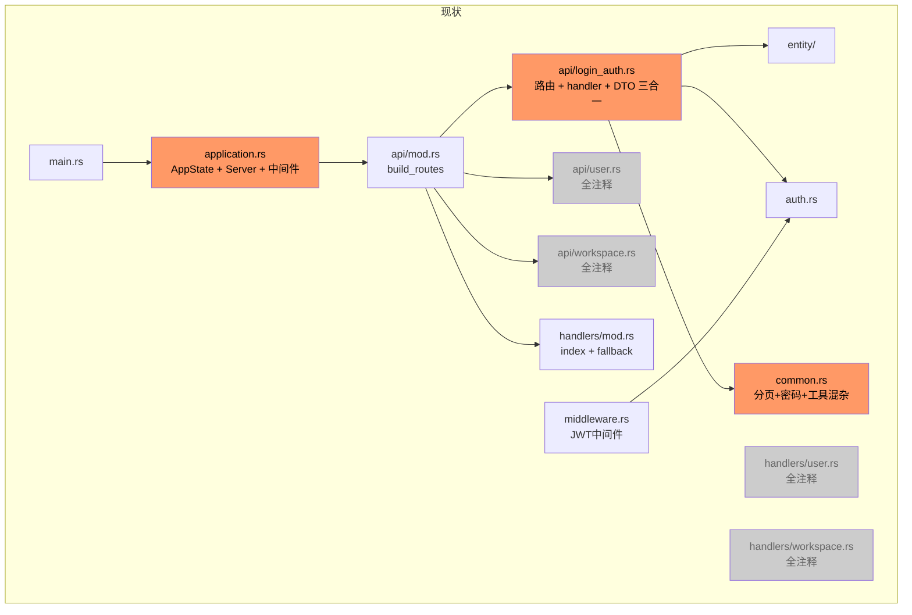
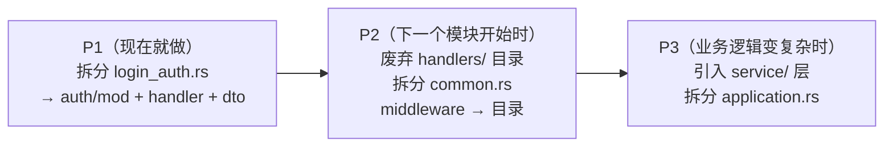

# 项目目录结构分析与建议

---

## 一、当前结构全览

```
explonz_bnd/
├── Cargo.toml
├── Makefile
├── migrations/
│   └── 20260708113847_1_launch_and_auth.sql
└── src/
    ├── main.rs
    ├── lib.rs                    # 模块声明入口
    ├── application.rs            # AppState + Server 启动 + 所有中间件配置
    ├── auth.rs                   # JWT 编解码 + Principal 定义
    ├── common.rs                 # 分页 + bcrypt 密码工具 + 反序列化工具
    ├── database.rs               # DB 连接初始化
    ├── error.rs                  # ApiError 枚举
    ├── logger.rs                 # tracing 初始化
    ├── middleware.rs             # JWT 认证中间件
    ├── request.rs                # BValidJson / BValidQuery / 邮箱验证
    ├── response.rs               # ApiResponse<T> 包装
    ├── config/
    │   ├── mod.rs
    │   ├── server.rs
    │   └── database.rs
    ├── entity/                   # sea-orm-codegen 自动生成
    │   ├── mod.rs
    │   ├── prelude.rs
    │   ├── users.rs
    │   ├── user_auth_providers.rs
    │   ├── refresh_tokens.rs
    │   ├── workspace.rs
    │   └── sea_orm_active_enums.rs
    ├── api/                      # 路由注册层
    │   ├── mod.rs               # build_routes()
    │   ├── login_auth.rs        # 路由 + handler + DTO（三合一）
    │   ├── user.rs              # 全部注释
    │   └── workspace.rs         # 全部注释
    └── handlers/                 # 业务逻辑层（原设计意图）
        ├── mod.rs               # index + fallback（仅两个简单函数）
        ├── user.rs              # 全部注释
        └── workspace.rs         # 全部注释
```

---

## 二、结构层次图



> 橙色 = 存在设计问题；灰色 = 已注释/废弃

---

## 三、现存问题分析

### 问题 1：`api/login_auth.rs` 承担四个职责

该文件同时包含：
- 路由注册（`routes()`）
- Handler 函数（`login`、`get_user_info`）
- 请求 DTO（`LoginParams`）
- 响应 DTO（`LoginResponse` / `AuthResponseModel`、`UserModel`）

随着接口增加，这个文件会迅速膨胀，且职责边界不清。

### 问题 2：`api/` 与 `handlers/` 两层架构形同虚设

设计意图是 `api/` 只做路由注册，业务逻辑委托给 `handlers/`。但：
- `login_auth.rs` 直接在 `api/` 层写了 handler 逻辑，绕过了 `handlers/`
- `handlers/user.rs` 和 `handlers/workspace.rs` 全部注释，实际空置
- 最终只有 `handlers/mod.rs` 的两个简单函数在用

两层架构带来了目录复杂度，却没有发挥分层价值。

### 问题 3：缺少 `service/` 层

Handler 直接操作 `entity/`，所有数据库查询、业务规则都写在 handler 里。业务逻辑增长后：
- 同一业务逻辑无法在多个 handler 复用
- 单元测试困难（handler 依赖 `AppState`，需要真实 DB）

### 问题 4：`common.rs` 是杂物箱

当前混合了三类不相关的工具：
- 分页参数（`Pagination`、`Page<T>`）
- 密码哈希（`hash_password`、`verify_password`）
- 通用反序列化（`deserialize_number`）

随着项目增长会持续膨胀，新增功能时不知道该放哪里。

### 问题 5：`application.rs` 职责过重

一个文件承担了：
- `AppState` 定义
- `Server` 启动逻辑
- CORS 配置
- Timeout 配置
- Body Limit 配置
- TraceLayer 配置

### 问题 6：`middleware.rs` 仅 JWT 却命名宽泛

只有 JWT 认证一个中间件，但命名 `middleware.rs` 暗示未来会有更多。作为单文件，后续添加中间件时无法清晰扩展。

---

## 四、结论：是否适合中型项目？

| 维度 | 评分 | 说明 |
|------|------|------|
| 基础设施层（config、database、logger） | ✅ 良好 | 职责清晰，结构合理 |
| 错误处理（error.rs） | ✅ 良好 | `thiserror` + HTTP 状态码映射完整 |
| 响应包装（response.rs） | ✅ 良好 | 统一的 `ApiResponse<T>` 泛型设计合理 |
| entity 层 | ✅ 良好 | 自动生成，无需干预 |
| 路由 / Handler 组织 | ⚠️ 待改进 | 职责混合、两层架构虚设 |
| 业务逻辑分层 | ❌ 缺失 | 无 service 层，handler 直连 DB |
| 工具代码组织 | ⚠️ 待改进 | `common.rs` 是杂物箱 |
| 中间件扩展性 | ⚠️ 待改进 | 单文件，无扩展结构 |

**总体结论：** 当前结构适合**小型项目或早期原型**。核心基础设施（配置、DB、错误、响应）的设计质量不错，但随着功能模块增加（user、workspace、OAuth 等），缺少 service 层和模块化的 api 组织会造成明显的维护压力。

---

## 五、推荐结构

核心原则：**不过度设计，按功能模块水平切分 api 层，引入轻量 service 层**。

```
src/
├── main.rs
├── lib.rs
│
├── config/                   # 保持现状
│   ├── mod.rs
│   ├── server.rs
│   └── database.rs
│
├── entity/                   # 保持现状（自动生成）
│   └── ...
│
├── infrastructure/           # 基础设施（平铺文件改为目录）
│   ├── mod.rs
│   ├── database.rs           # ← 现在的 database.rs
│   ├── logger.rs             # ← 现在的 logger.rs
│   └── jwt.rs                # ← 现在的 auth.rs（重命名更清晰）
│
├── common/                   # 工具（common.rs 拆分为目录）
│   ├── mod.rs
│   ├── pagination.rs         # Pagination / Page<T>
│   └── password.rs           # hash_password / verify_password
│
├── error.rs                  # 保持现状
├── response.rs               # 保持现状
├── request.rs                # 保持现状
├── application.rs            # 保持现状（或拆出 server.rs）
│
├── middleware/               # 中间件目录（middleware.rs → 目录）
│   ├── mod.rs                # pub use jwt_auth::get_auth_layer
│   └── jwt_auth.rs           # ← 现在的 middleware.rs 内容
│
├── service/                  # 业务逻辑层（新增）
│   ├── mod.rs
│   ├── auth.rs               # 登录/注册/token 刷新业务逻辑
│   ├── user.rs               # 用户业务逻辑
│   └── workspace.rs          # 工作区业务逻辑
│
└── api/                      # 表现层：路由 + handler + DTO（按模块组织）
    ├── mod.rs                # build_routes()
    ├── auth/
    │   ├── mod.rs            # routes() — 路由注册
    │   ├── handler.rs        # login / logout / refresh handler
    │   └── dto.rs            # LoginParams / AuthResponseModel / UserModel
    ├── user/
    │   ├── mod.rs
    │   ├── handler.rs
    │   └── dto.rs
    └── workspace/
        ├── mod.rs
        ├── handler.rs
        └── dto.rs
```

---

## 六、改动优先级



### P1 — 立即可做，收益最大

将 `api/login_auth.rs` 按职责拆为三个文件：

```
api/auth/
├── mod.rs       # fn routes() -> Router<AppState>
├── handler.rs   # pub async fn login(...) / get_user_info(...)
└── dto.rs       # LoginParams / AuthResponseModel / UserModel
```

这个改动不影响任何运行逻辑，但能立即让 `login_auth.rs` 当前的 ~200 行有清晰的归属，
后续新增 `POST /auth/logout`、`POST /auth/refresh` 时各归各位。

### P2 — 开发新模块时顺手做

- 删除已全部注释的 `handlers/` 目录（user 和 workspace 的 handler 直接放 `api/user/handler.rs`）
- 将 `common.rs` 拆为 `common/pagination.rs` 和 `common/password.rs`
- 将 `middleware.rs` 改为 `middleware/` 目录，便于后续添加限流、日志等中间件

### P3 — 业务复杂度提升后引入

当同一业务逻辑（如"注册"）需要在多处复用，或需要对 service 做单元测试时，引入 `service/` 层：

```rust
// api/auth/handler.rs — handler 只做参数提取和响应组装
pub async fn login(...) -> ApiResult<AuthResponseModel> {
    let result = AuthService::login(&db, email, password).await?;
    Ok(ApiResponse::success("login success", Some(result)))
}

// service/auth.rs — 业务逻辑集中在这里，可单独测试
impl AuthService {
    pub async fn login(db: &DatabaseConnection, email: &str, password: &str)
        -> Result<AuthResponseModel, ApiError> { ... }
}
```
