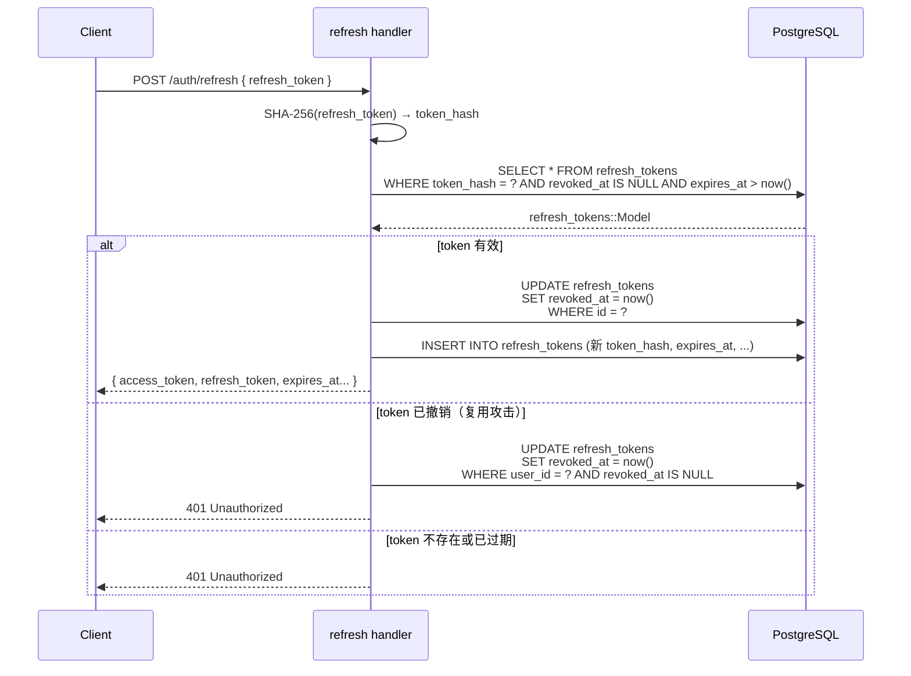

# refresh_tokens.revoked_at 字段更新时机

`revoked_at` 是 refresh token **主动失效** 的时间戳，以下场景应该写入值。

---

## 一、必须撤销（安全强制）

| 场景 | 触发操作 |
|------|----------|
| 用户主动登出 | `POST /auth/logout` → 将当前 refresh token 的 `revoked_at = now()` |
| 用户修改密码 | 密码变更后，撤销该用户**所有**未过期的 refresh token |
| Refresh Token 轮换 | 用旧 token 换新 token 时，立即撤销旧 token（防重放） |
| 检测到 token 复用攻击 | 一个已被撤销的 token 再次被使用，说明可能泄露，撤销该用户**所有** token |

## 二、建议撤销（安全增强）

| 场景 | 触发操作 |
|------|----------|
| 用户在"设备管理"中手动踢出某设备 | 撤销对应设备的 refresh token |
| 管理员封禁账号 | 撤销该用户所有 refresh token |
| 用户修改邮箱 / 绑定新账号 | 视安全策略决定是否全量撤销 |

---

## 三、验证时的判断逻辑

每次用 refresh token 换 access token 时，需同时检查三个条件：

```sql
SELECT * FROM refresh_tokens
WHERE token_hash = $1
  AND revoked_at IS NULL    -- 未被主动撤销
  AND expires_at > now()    -- 未自然过期
```

三个条件缺一不可：`revoked_at IS NULL` 是主动失效检查，`expires_at > now()` 是自然过期检查。

---

## 四、为什么用 revoked_at 而不是直接删除记录？

保留记录 + 打时间戳的好处：

- **审计日志**：可以查到 token 是何时、因何原因被撤销
- **攻击检测**：检测到已撤销的 token 被复用时，可追溯历史
- **数据完整性**：外键关联不会因删除而断裂

定期清理可用后台任务删除过期旧记录：

```sql
DELETE FROM refresh_tokens
WHERE expires_at < now() - INTERVAL '7 days';
```

---

## 五、轮换撤销流程图


